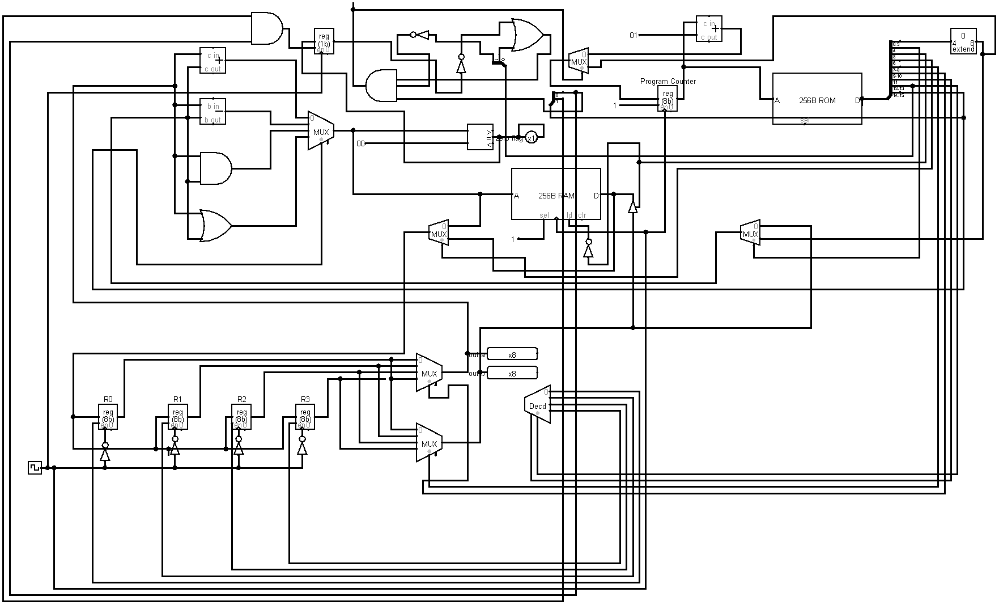

# 8-bit CPU (Logisim)

A custom 8-bit CPU designed in Logisim (classic), built to execute simple programs compiled from C.

## Circuit Overview

## Architecture

- **Registers:** R0, R1, R2, R3 — four 8-bit general-purpose registers
- **Memory:** 256B RAM (data) + 256B ROM (program)
- **ALU:** Supports arithmetic and logic operations with carry in/out
- **Program Counter:** 8-bit register, increments each cycle or jumps on branch
- **Instruction Decoder:** Drives all control signals from the fetched opcode
- **MUX network:** Routes data between registers, ALU, RAM, and ROM

## Files

| File | Description |
|------|-------------|
| `MyCpu.circ` | Main circuit — open in Logisim (classic) |
| `cpu_schematic.png` | Screenshot of the full CPU circuit |

## How to Run

1. Install [Logisim](http://www.cburch.com/logisim/)
2. Open `MyCpu.circ`
3. Load your program into the ROM
4. Tick the clock to step through execution
